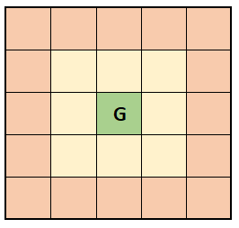
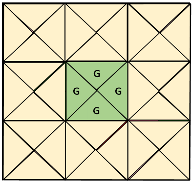

# GridWorldSingle

Implementation of Gridworld domains based on OpenAI Gym 0.15.4.

**GridWorldSingle**

An experimental 5x5 Gridworld domain with actions "up", "down", "left", and "right." The start state is chosen uniformly at random from all states at the border of the grid. The goal state is in the center of the grid.

**GridWorldOrient**

The [Gridworld](https://dl.acm.org/doi/10.5555/3020419.3020441) domains used in the work of Norm Ferns in which the agent's state is a combination of its orientation and its location in the grid. The agent can choose from the actions "forward" and "rotate" at each time point. "rotate" changes the agent's orientation clockwise and "forward" deterministically moves the agent one step forward if possible. A reward of 1 is obtained for reaching the goal grid location in the center of the grid and a reward of 0 for all other state-action combinations. The start state is chosen uniformly at random from all non-terminal states and performing 100 actions or reaching a goal state end an episode. The width of the underlying grid can be controlled.

The parameter "augmented" can be set to True to create a domain in which the abstract states of the coarsest Markov state abstraction are different from the ones of a Q*-irrelevance abstraction. Specifically, all non-terminal states are copied and an additional terminal state is created. For each state copy, the transition and reward probabilities for the optimal action are equivalent to the ones of the corresponding original state. Taking a non-optimal action a in the copy of a state s, however, leads to a reward of Q*(s, a) and to a transition to the new terminal state. Thus, the state copies have the same Q* values as the original states but different transition probabilities. Note that a Q*-irrelevance abstraction would map each copied state to the same activation as the corresponding original state, whereas the coarsest Markov state abstraction would map an original state and its copy to different activations.

The parameter "modified_rewards" can be set to True to change the reward function. More precisely, an immediate reward of -1 is obtained for moving forward in 4 states rather than the original reward of 0.

The parameter "modified_transitions" can be set to True to change some of the transition probabilities.
